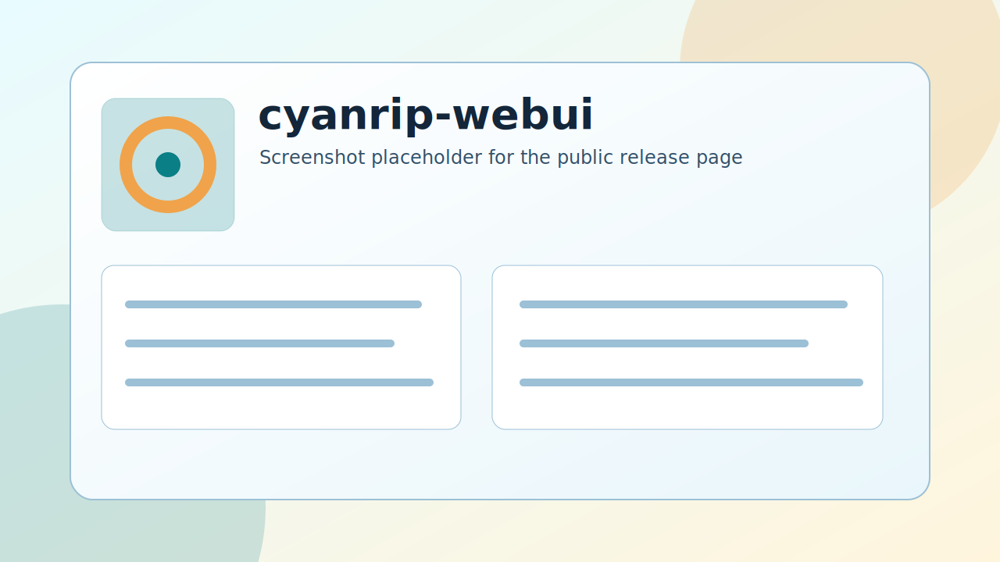

<p align="center">
  
</p>

# cyanrip-webui

`cyanrip-webui` is an unofficial Linux desktop/web interface for `cyanrip`.
It starts a local backend, opens a browser-based workflow, scans an Audio CD, lets you review metadata, and then starts the actual cyanrip rip.



## Current Status

This is `v0.1-alpha`.

The software was built as vibe coding software for private use and is published only in case it is useful to someone else. It has not been intensively tested. Use it at your own risk. There are no guarantees and no liability for damaged data, wrong metadata, failed rips, broken drives, or any other outcome.

`cyanrip-webui` is not affiliated with, endorsed by, or coordinated with the cyanrip project. It is a separate wrapper around the cyanrip command line tool. Bugs in this WebUI should be reported to this project, not to cyanrip.

## Recommended Use

Download the AppImage from the GitHub Releases page:

https://github.com/silverlps/cyanrip-webui/releases

Then run it:

```bash
chmod +x cyanrip-webui-v0.1-alpha-x86_64.AppImage
./cyanrip-webui-v0.1-alpha-x86_64.AppImage
```

The application keeps running in the background. A system tray icon should appear in your desktop panel/taskbar. Use that icon to open cyanrip-webui in the browser or quit the application.

By default, AppImage runs use:

- Bundled `cyanrip` binary inside the AppImage
- Output directory `output` next to the AppImage file
- WebSocket communication for frontend/backend JSON actions
- HTTP only for initial HTML/static assets, locale files, cover image previews, and the first settings/capability request

If WebSocket transport fails, the app intentionally does not fall back to HTTP by default. For debugging you can opt in:

```bash
./cyanrip-webui-v0.1-alpha-x86_64.AppImage --enable-http-fallback
```

## Workflow

1. Insert an Audio CD.
2. Scan the disc.
3. Review MusicBrainz metadata, AccurateRip status, cover art, disc fields, and track fields.
4. Adjust release/disc metadata if needed.
5. Select output format and naming.
6. Start the rip.

The UI includes handling for common cyanrip metadata edge cases:

- Multiple MusicBrainz releases for one Disc ID
- No MusicBrainz release for the Disc ID, including the MusicBrainz submission link
- Manual MusicBrainz release selection via `-R`
- Multi-disc release disc-number metadata via `-c`
- Manual cover art through URL, local file selection, or browser upload

## Requirements

- Linux desktop or Linux headless system
- Optical drive supported by cyanrip/libcdio
- Browser available on the same machine
- For source-tree runs: Python 3 and a cyanrip binary at `./bin/cyanrip`

The AppImage is the intended user path. Source-tree execution is mainly for development.

## Source Run

```bash
python3 -m venv .venv
source .venv/bin/activate
pip install -r requirements.txt
mkdir -p bin
cp /usr/bin/cyanrip ./bin/cyanrip
chmod +x ./bin/cyanrip
python3 launcher.py
```

Open:

```text
http://127.0.0.1:8080
```

## Project Links

- Project: https://github.com/silverlps/cyanrip-webui
- Development notes: [DEVELOPMENT_PRACTICES.md](DEVELOPMENT_PRACTICES.md)
- Third-party licenses: [THIRD_PARTY_LICENSES.md](THIRD_PARTY_LICENSES.md)

## License

`cyanrip-webui` is licensed under the MIT License. Bundled or referenced third-party components keep their own licenses. The bundled cyanrip binary is covered by cyanrip's license, not by this project's MIT license.
